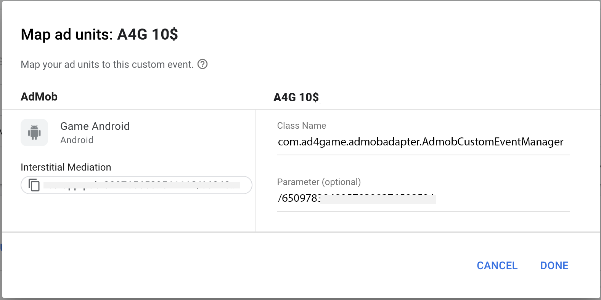

# Integrate Ad4Game with Admob Mediation
**Features**

- [x] Banner
- [x] Interstitial
- [x] Rewarded
 
**Requirements**

- Google Mobile Ads SDK 21.0.0 or higher
- Use Android Studio 3.2 or higher
- A minSdkVersion of 19 or higher
- A compileSdkVersion of 28 or higher

**Installation**
### Import adapter into your app/game

Add the following implementation dependency with the latest version of the adapter in the app-level `build.gradle` file:

```java
repositories {
    maven {url "https://github.com/ad4game/a4g-admob/raw/main" }
}
```

```java
// ...
dependencies {
    implementation fileTree(dir: 'libs', include: ['*.jar'])
    implementation 'com.google.android.gms:play-services-ads:21.4.0'
    // ⬇ Ad4Game implementation
    implementation 'com.Ad4game:admobmanager:1.0.7'
} 
// ...
```

**Usage**
**GDPR Compliance**</br>

If you are not using any Consent Management Platform to handle privacy issues and managing user consent with your own solution, you have to inform admob mediation and mediation partners about the consent. The following code snippet is sample for gdpr consent usage for admob mediation. If you already have the snippet like below you need to add all these extras bundles for the Ad4Game custom event adapter as well.

```java
AdRequest.Builder builder = new AdRequest.Builder();
Bundle extras = new Bundle();
extras.putString("npa", "1");
builder.addNetworkExtrasBundle(AdMobAdapter.class, extras);

// Add this for Ad4Game
builder.addNetworkExtrasBundle(type.equals("banner") ? AdmobCustomEventBanner.class :
                type.equals("rewarded") ? AdmobCustomEventRewarded.class :
                        AdmobCustomEventInterstitial.class,
        extras);
```

**Configure mediation settings for your AdMob ad unit**
You need to add Ad4Game placements provided by the Ad4Game team to the mediation configuration as waterfall ad source for your ad unit.




**Custom Event screen parameters**</br>
**Class Name** : You can use the following parameters depending on the ad unit format of the mediation group.

* Interstitial / Rewarded / Banner : com.ad4game.admobadapter

**Parameter** : Ad4Game placement ids for each floor price provided by the Ad4Game team

